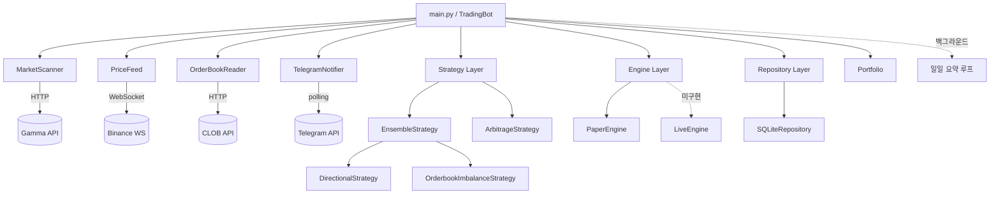

# Architecture

## 시스템 개요



## 핵심 컴포넌트

### 3-Layer ABC 설계

교체 가능한 레이어를 ABC(Abstract Base Class)로 정의하여, 설정 변경만으로 Paper↔Live 전환이 가능하다.

| Layer | ABC | 구현체 | 역할 |
|-------|-----|--------|------|
| Strategy | `Strategy` | Directional, OrderbookImbalance, Ensemble, Arbitrage | 시그널 생성 |
| Engine | `ExecutionEngine` | PaperEngine, LiveEngine (미구현) | 주문 실행 |
| Repository | `Repository` | SQLiteRepository | 데이터 영속화 |

### 주요 모듈

| 모듈 | 역할 |
|------|------|
| `TradingBot` | 메인 오케스트레이터. 컴포넌트 조립, 메인 루프, 백그라운드 태스크 관리 |
| `MarketScanner` | Gamma API에서 `btc-updown-5m-{unix_timestamp}` slug 패턴으로 마켓 검색 |
| `PriceFeed` | WebSocket으로 실시간 BTC 가격 수집 |
| `OrderBookReader` | CLOB API에서 오더북 조회 |
| `Portfolio` | 잔액/PnL/스냅샷 관리, resolution 처리 |
| `TelegramNotifier` | 거래/리졸루션/일일 요약 알림 + 명령어 핸들링 |

## 데이터 흐름

### 메인 루프 — 한 틱의 흐름

```
_tick() (매 30초)
├─ data/health 파일에 타임스탬프 기록 (Docker healthcheck용)
├─ MarketScanner.scan_once() → Gamma API에서 활성 5m BTC 마켓 목록
├─ _check_resolutions() → 리졸브된 마켓의 오픈 트레이드 정산
│   ├─ Engine.check_resolution()
│   ├─ Portfolio.handle_resolution()
│   ├─ Engine.credit_resolution_payout()
│   └─ Notifier.notify_resolution()
└─ _evaluate_market() (각 ACTIVE 마켓)
    ├─ 이미 오픈 트레이드가 있으면 SKIP
    ├─ OrderBookReader.get_both_books() → CLOB API
    ├─ Strategy.evaluate() → Signal
    ├─ 신뢰도 < threshold → SKIP
    ├─ Engine.execute_order() → Trade
    ├─ Portfolio.record_trade()
    └─ Notifier.notify_trade()
```

### 백그라운드 태스크

| 태스크 | 주기 | 동작 |
|--------|------|------|
| `_daily_summary_loop` | 매일 자정 KST (15:00 UTC) | Portfolio 스냅샷 저장 + 텔레그램 일일 요약 |

## 전략 시스템

### EnsembleStrategy (만장일치 투표)

2개의 하위 전략을 `asyncio.gather`로 병렬 실행한 뒤 합의로 최종 방향을 결정한다.

| 전략 | 방법 | 시그널 |
|------|------|--------|
| DirectionalStrategy | BTC 가격 모멘텀 + EMA(3/8) 크로스오버 | UP / DOWN |
| OrderbookImbalanceStrategy | bid/ask 볼륨 비율이 임계값 초과 시 | UP / DOWN |

- `min_votes=2` — 두 전략 모두 같은 방향을 가리켜야 진입 (만장일치)
- 불일치 시 SKIP
- 합의된 시그널의 평균 신뢰도를 최종 confidence로 사용

### ArbitrageStrategy (별도 실행)

Up/Down 양측의 best ask 합계가 $1.00 미만이면 (수수료 차감 후) 양측 동시 매수.

## 설계 결정

### ABC 기반 교체 가능 레이어

**맥락**: Paper trading으로 검증 후 실거래 전환이 필요
**결정**: Strategy/Engine/Repository를 ABC로 추상화
**근거**: `TRADING_MODE` 설정만 바꾸면 Paper→Live 전환 가능한 구조. 테스트에서도 mock 주입이 용이
**현재 상태**: PaperEngine만 구현됨. LiveEngine은 py-clob-client 기반 스텁만 존재

### 이중 잔액 관리 (Engine + Portfolio)

**맥락**: Engine은 주문 실행 시 잔액을 차감하고, Portfolio는 전체 성과를 추적
**결정**: 두 레이어에서 독립적으로 잔액 관리
**근거**: 관심사 분리 — Engine은 "주문 가능 여부", Portfolio는 "성과 기록". 재시작 시 Portfolio 스냅샷에서 Engine 잔액을 복원

### asyncio 단일 프로세스

**맥락**: 메인 루프 + 텔레그램 폴링 + WebSocket + 백그라운드 태스크가 동시 실행
**결정**: asyncio 단일 이벤트 루프로 모든 비동기 작업 처리
**근거**: 외부 의존성(Redis, Celery 등) 없이 단순한 배포 구조 유지. 5분 마켓 특성상 초당 처리량이 낮아 단일 프로세스로 충분

### 파일 기반 healthcheck

**맥락**: Docker에서 봇 생존 여부를 확인해야 함
**결정**: 매 틱마다 `data/health` 파일에 타임스탬프 기록, Docker가 120초 내 갱신 여부 확인
**근거**: HTTP 서버를 별도로 띄울 필요 없음. 파일 하나로 healthcheck 완결

## 인프라

- **서버**: Hetzner CAX11 (ARM64)
- **CI/CD**: GitHub Actions → SSH로 VPS 접속 → `git pull` + `docker compose up -d --build`
- **Docker**: Python 3.11-slim, non-root 유저(UID 1000)
- **데이터**: `./data` 볼륨 마운트 (SQLite DB + health 파일)

## 디렉토리 구조

```
src/
├── main.py              # TradingBot 오케스트레이터 + asyncio entrypoint
├── config.py            # frozen Config dataclass (환경변수 바인딩)
├── models.py            # 도메인 모델 (Market, Trade, Signal, OrderBook 등)
├── market_scanner.py    # Gamma API 마켓 검색
├── price_feed.py        # WebSocket BTC 가격 스트림
├── orderbook.py         # CLOB API 오더북 조회
├── portfolio.py         # 잔액/PnL/스냅샷 관리
├── notifier.py          # 텔레그램 알림
├── commands.py          # 텔레그램 명령어 + InlineKeyboard UI
├── engine/
│   ├── base.py          # ExecutionEngine ABC
│   ├── paper.py         # PaperEngine (시뮬레이션)
│   └── live.py          # LiveEngine (실거래, py-clob-client)
├── repository/
│   ├── base.py          # Repository ABC
│   └── sqlite.py        # SQLiteRepository (aiosqlite)
└── strategy/
    ├── base.py           # Strategy ABC
    ├── directional.py    # 모멘텀 + EMA 크로스오버
    ├── orderbook_imbalance.py  # 오더북 bid/ask 불균형
    ├── ensemble.py       # 만장일치 투표 앙상블
    └── arbitrage.py      # Up+Down 양측 매수 아비트라지
```
